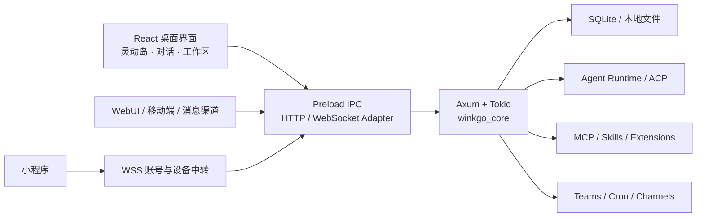

<!-- Modified from AionUI by WINK GO contributors in 2026. -->
<div align="center">

# WINK GO · AI 智能体工作台

**把 AI 智能体、模型、技能、MCP、本地文件与自动化，装进一个真正能干活的桌面工作台。**

WINK GO — AI Agent Workspace

[项目主页](https://github.com/WINKGO/wink-go) · [下载](https://github.com/WINKGO/wink-go/releases) · [功能全景](docs/guides/product-overview.zh-CN.md) · [隐私政策](PRIVACY.md) · [服务条款](TERMS.md) · [开发文档](docs/README.md) · [问题反馈](https://github.com/WINKGO/wink-go/issues)

</div>

> [!IMPORTANT]
> **WINK GO 当前作为开放、免费、公益性质的 AI 智能体桌面项目发布。** 桌面客户端现有功能向所有用户开放，不设置付费功能分级。第三方模型、API、云端中转、语音、消息平台或其他外部服务可能产生资源费用，具体以相应服务说明为准。

## WINK GO 是什么

WINK GO 是一个本地优先、跨平台的 AI 智能体工作台。它把 AI 对话、智能体管理、多智能体协作、MCP、Skills、本地文件、自动化任务、WebUI 和桌面灵动岛统一到一个应用里，让智能体不只回答问题，还能围绕真实工作区持续执行任务。

你可以用它完成这些事情：

- 在同一个界面管理 WINK GO、用户自行安装的官方 Claude Code/Codex CLI，以及自定义 ACP 智能体。
- 让智能体读取工作区、调用工具、使用 Skills，并在授权确认后执行操作。
- 创建多个角色明确的智能体团队，进行分工、协作与任务交接。
- 通过 MCP 接入本地工具或远程服务，通过 WebUI 和支持的消息渠道远程使用。
- 借助灵动岛查看任务动态、控制媒体、处理通知、专注计时、收纳文件和快速转换格式。
- 用一次性设备码把配套小程序与指定电脑安全配对，在手机上查看绑定与在线状态，并进入已绑定电脑的远程 WebUI。

## 功能全景

| 位置             | 当前能力                                                                                                                                    |
| ---------------- | ------------------------------------------------------------------------------------------------------------------------------------------- |
| **AI 对话**      | 流式回复、思考与计划展示、工具调用、权限确认、模型/模式切换、历史搜索、会话导出、文件引用，以及麦克风或音频文件转文字                       |
| **工作区与文件** | 文件浏览、上传、拖入、搜索、新建、复制、重命名、删除、压缩、变更监听，以及代码、Markdown、HTML、图片、PDF、URL、Diff、Word、Excel、PPT 预览 |
| **智能体**       | WINK GO CLI、用户自行安装的官方 Claude Code/Codex CLI、自定义 ACP 兼容智能体，以及检测、健康检查、修复、启停和高级参数配置                |
| **助手**         | 自定义身份、提示词、上下文、默认智能体、默认模型、权限策略和 Skills 绑定                                                                    |
| **多智能体团队** | 创建团队与角色、群发/私聊、共享工作区、实时状态、运行、暂停、取消和重试                                                                     |
| **MCP 工具**     | MCP 服务增删改、启停、连接测试、工具浏览、JSON/批量导入、OAuth，以及 stdio、Streamable HTTP 和兼容 SSE 传输                                 |
| **Skills 中心**  | 文件夹/ZIP 导入、扫描、启停、删除、批量管理、详情查看和助手绑定                                                                             |
| **定时任务**     | 小时、每日、工作日、每周和自定义 Cron；支持指定助手、智能体、模型、工作区、失败重试、立即执行和历史追踪                                     |
| **格式工坊**     | 文本清洗、JSON 格式化、Markdown 大纲，以及 NCM、音视频、GIF、图片和文档的常用格式转换                                                       |
| **灵感中心**     | 本地任务模板，以及部分生活服务适配器的配置、连通测试和任务预览；第三方 Skill 由用户从授权来源自行安装                                       |
| **AI 知识画布**  | AI 分析桥接与实验入口；公开版暂不交付尚未完成来源、许可与发布材料审核的完整画布运行组件                                                     |
| **WebUI 与远程** | 桌面端启停 WebUI、局域网访问、二维码令牌、小程序一次性设备码、管理员密码、无界面启动，以及 HTTP、WebSocket、STT 代理                        |
| **消息渠道**     | Telegram、飞书/Lark、钉钉和微信接入；企业微信、Slack、Discord 仍在后续适配阶段                                                              |
| **桌面体验**     | 灵动岛、桌面宠物、系统托盘、通知、主题、外观、快捷键和扩展设置                                                                              |

更完整的入口、状态和使用条件见 [《WINK GO 功能全景与产品路线图》](docs/guides/product-overview.zh-CN.md)。

## 灵动岛

灵动岛是 WINK GO 的桌面信息与快捷操作中枢。它既可以嵌入主窗口标题栏，也可以作为透明、置顶、可移动的独立浮窗运行，并根据当前任务自动伸缩。

### 当前已经具备

| 模块             | 能力                                                                                                |
| ---------------- | --------------------------------------------------------------------------------------------------- |
| **AI 任务动态**  | 实时展示当前智能体、工具/MCP 调用、执行完成、失败和待授权状态；活动摘要会过滤密钥标记与本地绝对路径 |
| **系统媒体**     | 在 Windows 上读取当前媒体会话，显示封面和曲目信息，并提供上一首、播放/暂停、下一首                  |
| **通知卡片**     | 在 Windows 上汇总系统通知，支持展开查看和隐私模式                                                   |
| **专注计时**     | 1–180 分钟自定义专注计时，提供开始、暂停、继续和结束控制                                            |
| **定时任务摘要** | 显示下一项任务和运行状态，并可快速进入定时任务页                                                    |
| **文件收纳**     | 拖放接收文件、暂存、自动分类、智能重命名、选择目标目录、复制/移动、批次撤销和最近文件架             |
| **快速转换**     | NCM 转 MP3、视频转 MP4/压缩、GIF 压缩、音频转 MP3、图片压缩和文档转 PDF                             |
| **桌面设置**     | 显示/隐藏、主题、透明度、位置、全屏自动隐藏和全局快捷键                                             |

Windows 媒体、系统通知和原生 OLE 文件拖入属于 Windows 专属能力；媒体转换依赖 FFmpeg，Office/OpenDocument 转 PDF 依赖 WPS Office 或 LibreOffice。应用会检测本机引擎后再启用对应操作。

聊天输入框目前已经支持语音转文字；**灵动岛语音指令、桌面控制和统一 AI 入口属于后续路线图，而不是当前已上线功能。**

## 小程序与电脑桌面版配对

小程序配对是 WINK GO 的多端协同能力。桌面端负责本地文件、Skills 和工具执行；云端只承担账号鉴权、首次绑定、消息路由和结果转发，不在云端替用户常驻运行完整桌面智能体。

### 首次配对

1. 在电脑上安装并登录 WINK GO，保持桌面端在线。
2. 打开 **设置 → MCP 配置 → 小智 MCP 连接**。
3. **云端设备转发** 默认开启；点击 **检测并修复**，等待页面显示必要链路正常。若不需要远程设备能力，可随时关闭该开关。
4. 在 **手机小程序设备绑定** 区域取得 10 位一次性设备码。
5. 在配套小程序的设备绑定页输入该设备码并确认。入口名称可能随小程序版本调整。
6. 绑定成功后，在小程序查看电脑在线状态，并通过 **远程 WebUI** 进入已绑定电脑。小程序原生文字/语音任务页尚未开放，不应把 Relay 已支持的消息协议误写成现有界面功能。

设备码只在 5 分钟内有效，并且使用一次后立即失效。过期时点击 **重新获取设备码** 即可。每个账号、安装实例、电脑、智能体、会话和任务都有独立标识；桌面端还会校验时间戳与随机数、拒绝跨账号任务，并对重复任务去重。


> [!NOTE]
> 小程序使用的是 **10 位一次性设备码**。局域网 WebUI / 移动端连接使用的是另一套 **二维码令牌**：先在桌面端启动 WebUI，再让手机与电脑连接同一可信局域网并扫描二维码。局域网直连可能需要放行系统防火墙；不要把未配置 HTTPS 和访问控制的本地端口直接暴露到公网。

## 技术特点

- **Electron + React 桌面层：** Electron 41、React 19、TypeScript 5、Vite 6、Arco Design 与 UnoCSS。
- **Rust 本地服务：** WINK GO Core（兼容 crate 名 `winkgo_core`）基于 Tokio、Axum 和 SQLite，按认证、会话、文件、Office、MCP、智能体、团队、定时任务与渠道等领域拆分。
- **ACP + MCP 双协议：** ACP 负责接入与管理智能体，MCP 负责扩展工具和外部服务。
- **本地优先：** 会话、配置和工作区数据以本地 SQLite 与本地文件为主；桌面能力通过 preload IPC 边界调用。
- **实时事件通道：** REST 负责常规请求，WebSocket 传递流式回复、工具状态、团队状态和其他增量事件。
- **按需加载：** 页面级懒加载、空闲时分批预热、依赖分包、SQLite WAL 和异步 Rust 服务共同降低启动与运行负担。
- **多端协同：** 桌面客户端、WebUI、支持的消息渠道和移动端代码共享同一后端能力。
- **国际化：** 桌面端内置 13 种界面语言。



## 开放、免费与费用边界

- WINK GO 当前公开的桌面客户端和仓库源码面向所有用户开放，现有功能不设置付费解锁入口。
- 项目本身免费，不代表所有外部资源免费。模型推理、API、云端中转、语音识别、消息平台、网络流量或第三方 SaaS 可能由相应服务方计费。
- 用户可以选择完全本地的运行方式，也可以自行配置兼容端点、密钥或自托管服务；凭据和费用由所选服务决定。
- 如果未来在软件内提供可选付费服务，会单独标明服务内容、价格、服务主体和适用条款；这不会收回已经依据 Apache License 2.0 发布版本所授予的权利。

## 安装与使用

前往 [GitHub Releases](https://github.com/WINKGO/wink-go/releases) 获取当前公开安装包。构建流水线支持：

- Windows：NSIS 安装包
- macOS：DMG / ZIP
- Linux：DEB
- x64 与 ARM64 构建目标

具体平台和架构是否提供预编译包，以对应 Release 的附件为准。

WebUI 默认服务端口为 `25808`。局域网访问需要操作系统防火墙放行；如果要暴露到公网，请自行配置 HTTPS、访问控制、反向代理或安全隧道，不要直接开放本地服务端口。

## 后续路线图

1. **扩充灵动岛日常工具集合** — 把更多高频桌面小工具收进灵动岛，减少窗口切换。

2. **灵动岛语音识别与控制** — 将现有聊天语音识别延伸到灵动岛，支持语音指令、唤起和桌面操作。

3. **灵动岛统一 AI 入口** — 在灵动岛接入 AI 对话、上下文和工具调用，让它成为随时可用的智能入口。

4. **速度与性能持续优化** — 继续优化启动、渲染、智能体调度、文件处理与后台资源占用。

5. **持续接入更多智能体** — 适配更多 ACP 与自定义智能体，并扩展 MCP、Skills 和设备生态。

路线图表示产品方向，不构成版本日期或功能交付承诺。进展会在 [Releases](https://github.com/WINKGO/wink-go/releases) 中持续更新。

## 本地开发

### 环境要求

- Node.js 22–24
- Bun
- Rust stable + Cargo
- Python 3.11+
- Windows 构建需要 Rust MSVC 工具链与 Microsoft C++ Build Tools

### 启动

```bash
git clone https://github.com/WINKGO/wink-go.git
cd winkgo
bun install
cargo install --manifest-path backend/crates/winkgo-app/Cargo.toml --locked
bun run dev
```

常用检查：

```bash
bun run lint
bun run format:check
bunx tsc --noEmit
bun run test
```

完整环境说明见 [开发指南](docs/contributing/development.md)。

## 项目结构

| 目录                 | 内容                                            |
| -------------------- | ----------------------------------------------- |
| `packages/desktop/`  | Electron 主进程、preload 与 React renderer      |
| `backend/`           | Rust `winkgo_core`、Agent Runtime 与领域 crates |
| `packages/web-host/` | WebUI 静态托管、后端生命周期和反向代理          |
| `mobile/`            | Expo / React Native 移动端                      |
| `resources/`         | 应用图标、安装器和随包资源                      |
| `scripts/`           | 构建、发布、安装和检查脚本                      |
| `tests/`             | Vitest、契约、集成、E2E 与基准测试              |
| `docs/`              | 产品、使用、贡献、PRD 与主题文档                |

## 使用条件与当前边界

- WINK GO 不捆绑、下载或再分发 Claude Code 或 Codex。用户需自行安装 Anthropic/OpenAI 官方 CLI、遵守相应官方条款，并将命令加入 `PATH`。
- Claude 用户还需显式配置 `ANTHROPIC_API_KEY`，或同时配置兼容网关的 `ANTHROPIC_AUTH_TOKEN` 与 `ANTHROPIC_BASE_URL`。本项目不复用 Claude.ai 免费版、Pro 或 Max 订阅 OAuth。
- 外部智能体、MCP、消息渠道和生活服务适配器可能需要单独安装运行时，并配置网络、OAuth 或 API 凭据。
- 小程序设备中转依赖可用的 WINK GO 云端服务；中转服务可能产生服务器与带宽成本，是否收费以届时页面说明为准。
- 语音识别需要麦克风权限以及 OpenAI 兼容或 Deepgram STT 配置；实时转写能力取决于所用端点。
- 文件与 Office 能力以浏览、预览、监听和转换为主，不等同于原生 Word、Excel、PPT 编辑器。
- AI 知识画布当前为实验性能力。公开仓库没有包含被隔离的第三方运行资产，干净克隆不会自动获得该资产。
- 企业微信、Slack、Discord 当前仍是待适配渠道。
- 本地运行资产的来源和准备方式见 [本地运行资产说明](docs/guides/local-runtime-assets.md)。

## 文档与贡献

- [文档索引](docs/README.md)
- [功能全景与产品路线图](docs/guides/product-overview.zh-CN.md)
- [开发指南](docs/contributing/development.md)
- [WebUI 指南](docs/guides/webui.md)
- [贡献指南](CONTRIBUTING.md)

其他语言摘要：[繁體中文](docs/readme/readme_tw.md) · [日本語](docs/readme/readme_jp.md) · [한국어](docs/readme/readme_ko.md) · [Español](docs/readme/readme_es.md) · [Português](docs/readme/readme_pt.md) · [Türkçe](docs/readme/readme_tr.md) · [Русский](docs/readme/readme_ru.md) · [Українська](docs/readme/readme_uk.md)

## 许可证

WINK GO 以 [Apache License 2.0](LICENSE) 发布。账号、设备配对、云端中转和用户主动反馈的数据处理边界见[《隐私政策》](PRIVACY.md)与[《服务条款》](TERMS.md)。完整分发声明见 [NOTICE](NOTICE)，第三方归属与固定上游基线见 [THIRD_PARTY_NOTICES.md](THIRD_PARTY_NOTICES.md)。
