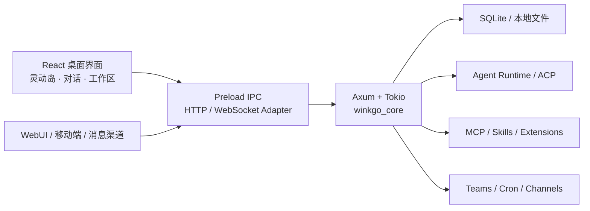

<div align="center">

# WINK GO · AI 智能体工作台

**把 AI 智能体、模型、技能、MCP、本地文件与自动化，装进一个真正能干活的桌面工作台。**

WINK GO — AI Agent Workspace

[](https://github.com/xuweihafeichangniu-lab/wink-go/releases)
[](#版本说明)
[](#安装与使用)
[](LICENSE)

[官网](https://winkgo.top) · [下载](https://github.com/xuweihafeichangniu-lab/wink-go/releases) · [功能全景](docs/guides/product-overview.zh-CN.md) · [开发文档](docs/README.md) · [问题反馈](https://github.com/xuweihafeichangniu-lab/wink-go/issues)

</div>

> [!IMPORTANT]
> **当前发布阶段，WINK GO 免费版已经开放现有 Pro 构建的全部功能。** 用户无需安装 Pro 客户端即可使用完整能力。Pro 仅保留为未来版本与授权规划，不代表当前存在额外付费功能。

## WINK GO 是什么

WINK GO 是一个本地优先、跨平台的 AI 智能体工作台。它把 AI 对话、智能体管理、多智能体协作、MCP、Skills、本地文件、自动化任务、WebUI 和桌面灵动岛统一到一个应用里，让智能体不只回答问题，还能围绕真实工作区持续执行任务。

你可以用它完成这些事情：

- 在同一个界面管理 WINK GO、Claude/Codex CLI 以及自定义 ACP 智能体。
- 让智能体读取工作区、调用工具、使用 Skills，并在授权确认后执行操作。
- 创建多个角色明确的智能体团队，进行分工、协作与任务交接。
- 通过 MCP 接入本地工具或远程服务，通过 WebUI 和支持的消息渠道远程使用。
- 借助灵动岛查看任务动态、控制媒体、处理通知、专注计时、收纳文件和快速转换格式。

## 功能全景

| 位置             | 当前能力                                                                                                                                    |
| ---------------- | ------------------------------------------------------------------------------------------------------------------------------------------- |
| **AI 对话**      | 流式回复、思考与计划展示、工具调用、权限确认、模型/模式切换、历史搜索、会话导出、文件引用，以及麦克风或音频文件转文字                       |
| **工作区与文件** | 文件浏览、上传、拖入、搜索、新建、复制、重命名、删除、压缩、变更监听，以及代码、Markdown、HTML、图片、PDF、URL、Diff、Word、Excel、PPT 预览 |
| **智能体**       | WINK GO CLI、托管的 Claude/Codex CLI、自定义 ACP 兼容智能体，以及检测、健康检查、修复、启停和高级参数配置                                   |
| **助手**         | 自定义身份、提示词、上下文、默认智能体、默认模型、权限策略和 Skills 绑定                                                                    |
| **多智能体团队** | 创建团队与角色、群发/私聊、共享工作区、实时状态、运行、暂停、取消和重试                                                                     |
| **MCP 工具**     | MCP 服务增删改、启停、连接测试、工具浏览、JSON/批量导入、OAuth，以及 stdio、Streamable HTTP 和兼容 SSE 传输                                 |
| **Skills 中心**  | 文件夹/ZIP 导入、扫描、启停、删除、批量管理、详情查看和助手绑定                                                                             |
| **定时任务**     | 小时、每日、工作日、每周和自定义 Cron；支持指定助手、智能体、模型、工作区、失败重试、立即执行和历史追踪                                     |
| **格式工坊**     | 文本清洗、JSON 格式化、Markdown 大纲，以及 NCM、音视频、GIF、图片和文档的常用格式转换                                                       |
| **灵感中心**     | 本地任务模板，以及部分生活服务适配器的配置、连通测试和任务预览                                                                              |
| **AI 知识画布**  | AI 分析桥接与可编辑画布页面；当前属于实验性能力，公开源码不包含被隔离的第三方画布运行资产                                                   |
| **WebUI 与远程** | 桌面端启停 WebUI、局域网访问、二维码令牌、管理员密码、无界面启动，以及 HTTP、WebSocket、STT 代理                                            |
| **消息渠道**     | Telegram、飞书/Lark、钉钉和微信接入；企业微信、Slack、Discord 仍在后续适配阶段                                                              |
| **桌面体验**     | 灵动岛、桌面宠物、系统托盘、通知、主题、外观、快捷键和扩展设置                                                                              |

更完整的入口、状态和使用条件见 [《WINK GO 功能全景与产品路线图》](docs/guides/product-overview.zh-CN.md)。

## 灵动岛

灵动岛是 WINK GO 的桌面信息与快捷操作中枢。它既可以嵌入主窗口标题栏，也可以作为透明、置顶、可移动的独立浮窗运行，并根据当前任务自动伸缩。

### 当前已经具备

| 模块             | 能力                                                                                                |
| ---------------- | --------------------------------------------------------------------------------------------------- |
| **AI 任务动态**  | 实时展示当前智能体、工具/MCP 调用、执行完成、失败和待授权状态；活动摘要会过滤密钥标记与本地绝对路径 |
| **系统媒体**     | 在 Windows 上读取当前媒体会话，显示封面和曲目信息，并提供上一首、播放/暂停、下一首                  |
| **通知卡片**     | 在 Windows 上汇总系统通知，支持展开查看和隐私模式                                                   |
| **专注计时**     | 1–180 分钟自定义专注计时，提供开始、暂停、继续和结束控制                                            |
| **定时任务摘要** | 显示下一项任务和运行状态，并可快速进入定时任务页                                                    |
| **文件收纳**     | 拖放接收文件、暂存、自动分类、智能重命名、选择目标目录、复制/移动、批次撤销和最近文件架             |
| **快速转换**     | NCM 转 MP3、视频转 MP4/压缩、GIF 压缩、音频转 MP3、图片压缩和文档转 PDF                             |
| **桌面设置**     | 显示/隐藏、主题、透明度、位置、全屏自动隐藏和全局快捷键                                             |

Windows 媒体、系统通知和原生 OLE 文件拖入属于 Windows 专属能力；媒体转换依赖 FFmpeg，Office/OpenDocument 转 PDF 依赖 WPS Office 或 LibreOffice。应用会检测本机引擎后再启用对应操作。

聊天输入框目前已经支持语音转文字；**灵动岛语音指令、桌面控制和统一 AI 入口属于后续路线图，而不是当前已上线功能。**

## 技术特点

- **Electron + React 桌面层：** Electron 37、React 19、TypeScript 5、Vite 6、Arco Design 与 UnoCSS。
- **Rust 本地服务：** `winkgo_core` 基于 Tokio、Axum 和 SQLite，按认证、会话、文件、Office、MCP、智能体、团队、定时任务与渠道等领域拆分。
- **ACP + MCP 双协议：** ACP 负责接入与管理智能体，MCP 负责扩展工具和外部服务。
- **本地优先：** 会话、配置和工作区数据以本地 SQLite 与本地文件为主；桌面能力通过 preload IPC 边界调用。
- **实时事件通道：** REST 负责常规请求，WebSocket 传递流式回复、工具状态、团队状态和其他增量事件。
- **按需加载：** 页面级懒加载、空闲时分批预热、依赖分包、SQLite WAL 和异步 Rust 服务共同降低启动与运行负担。
- **多端协同：** 桌面客户端、WebUI、支持的消息渠道和移动端代码共享同一后端能力。
- **国际化：** 桌面端内置 13 种界面语言。



## 版本说明

| 版本                      | 当前状态     | 功能范围                                      |
| ------------------------- | ------------ | --------------------------------------------- |
| **WINK GO 免费版 2.1.45** | 当前公开版本 | 已开放当前全部能力，包括代码中预留的 Pro 能力 |
| **WINK GO Pro**           | 未来版本预留 | 当前没有额外解锁项；后续版本策略另行公布      |

代码通过统一的能力解析器管理版本边界，当前策略为 `WINKGO_FREE_FULL_ACCESS = true`。这表示当前发布阶段全功能开放，同时保留未来调整版本策略的技术基础。

## 安装与使用

前往 [GitHub Releases](https://github.com/xuweihafeichangniu-lab/wink-go/releases) 获取当前公开安装包。构建流水线支持：

- Windows：NSIS 安装包
- macOS：DMG / ZIP
- Linux：DEB
- x64 与 ARM64 构建目标

具体平台和架构是否提供预编译包，以对应 Release 的附件为准。

WebUI 默认服务端口为 `25808`。局域网访问需要操作系统防火墙放行；如果要暴露到公网，请自行配置 HTTPS、访问控制、反向代理或安全隧道，不要直接开放本地服务端口。

## 后续路线图

1. **扩充灵动岛日常工具集合** — 把更多高频桌面小工具收进灵动岛，减少窗口切换。

2. **灵动岛语音识别与控制** — 将现有聊天语音识别延伸到灵动岛，支持语音指令、唤起和桌面操作。

3. **灵动岛统一 AI 入口** — 在灵动岛接入 AI 对话、上下文和工具调用，让它成为随时可用的智能入口。

4. **速度与性能持续优化** — 继续优化启动、渲染、智能体调度、文件处理与后台资源占用。

5. **持续接入更多智能体** — 适配更多 ACP 与自定义智能体，并扩展 MCP、Skills 和设备生态。

路线图表示产品方向，不构成版本日期或功能交付承诺。进展会在 [Releases](https://github.com/xuweihafeichangniu-lab/wink-go/releases) 中持续更新。

## 本地开发

### 环境要求

- Node.js 22–24
- Bun
- Rust stable + Cargo
- Python 3.11+
- Windows 构建需要 Rust MSVC 工具链与 Microsoft C++ Build Tools

### 启动

```bash
git clone https://github.com/xuweihafeichangniu-lab/wink-go.git
cd wink-go
bun install
cargo install --manifest-path backend/crates/winkgo-app/Cargo.toml --locked
bun run dev
```

常用检查：

```bash
bun run lint
bun run format:check
bunx tsc --noEmit
bun run test
```

完整环境说明见 [开发指南](docs/contributing/development.md)。

## 项目结构

| 目录                 | 内容                                            |
| -------------------- | ----------------------------------------------- |
| `packages/desktop/`  | Electron 主进程、preload 与 React renderer      |
| `backend/`           | Rust `winkgo_core`、Agent Runtime 与领域 crates |
| `packages/web-host/` | WebUI 静态托管、后端生命周期和反向代理          |
| `mobile/`            | Expo / React Native 移动端                      |
| `resources/`         | 应用图标、安装器和随包资源                      |
| `scripts/`           | 构建、发布、安装和检查脚本                      |
| `tests/`             | Vitest、契约、集成、E2E 与基准测试              |
| `docs/`              | 产品、使用、贡献、PRD 与主题文档                |

## 使用条件与当前边界

- 外部智能体、MCP、消息渠道和生活服务适配器可能需要单独安装运行时，并配置网络、OAuth 或 API 凭据。
- 语音识别需要麦克风权限以及 OpenAI 兼容或 Deepgram STT 配置；实时转写能力取决于所用端点。
- 文件与 Office 能力以浏览、预览、监听和转换为主，不等同于原生 Word、Excel、PPT 编辑器。
- AI 知识画布当前为实验性能力。公开仓库没有包含被隔离的第三方运行资产，干净克隆不会自动获得该资产。
- 企业微信、Slack、Discord 当前仍是待适配渠道。
- 本地运行资产的来源和准备方式见 [本地运行资产说明](docs/guides/local-runtime-assets.md)。

## 文档与贡献

- [文档索引](docs/README.md)
- [功能全景与产品路线图](docs/guides/product-overview.zh-CN.md)
- [开发指南](docs/contributing/development.md)
- [WebUI 指南](docs/guides/webui.md)
- [贡献指南](CONTRIBUTING.md)

其他语言摘要：[繁體中文](docs/readme/readme_tw.md) · [日本語](docs/readme/readme_jp.md) · [한국어](docs/readme/readme_ko.md) · [Español](docs/readme/readme_es.md) · [Português](docs/readme/readme_pt.md) · [Türkçe](docs/readme/readme_tr.md) · [Русский](docs/readme/readme_ru.md) · [Українська](docs/readme/readme_uk.md)

## 许可证

WINK GO 以 [Apache License 2.0](LICENSE) 发布。部分源码派生自 AionUi，并在保留原始版权声明的基础上进行独立修改。完整分发声明见 [NOTICE](NOTICE)，第三方归属与固定上游基线见 [THIRD_PARTY_NOTICES.md](THIRD_PARTY_NOTICES.md)。

AionUi 仅作为法律归属信息出现；WINK GO 是独立开发、独立命名和独立发布的衍生项目，该归属不代表原项目对 WINK GO 的赞助、认可或关联。
